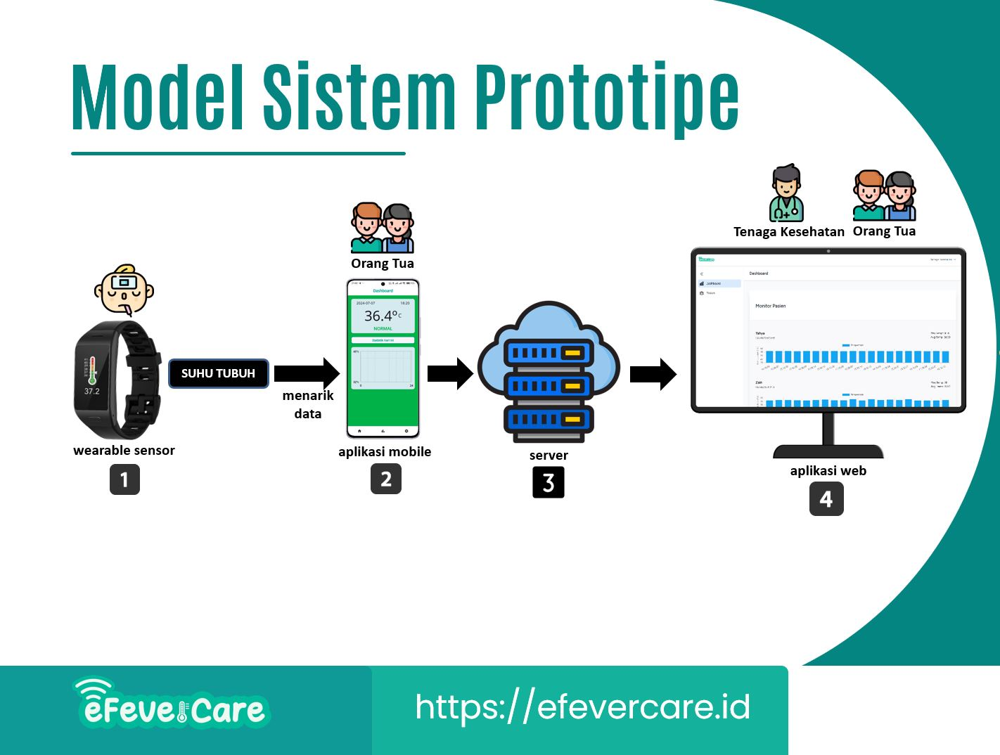

# eFeverCare Web
eFeverCare: Sistem Monitoring Demam Bayi atau Anak. Sistem ini terbagi dua yaitu aplikasi mobile dan aplikasi web. 

Aplikasi web digunakan orang tua untuk memantau suhu tubuh anaknya. Selain itu aplikasi ini juga dapat diakses oleh dokter atau perawat agar bisa memantau suhu tubuh pasien. Aplikasi web ini telah dipublish dan bisa diakses di [eFeverCar.ID](https://efevercare.id/).
Aplikasi web dapat diakses oleh tiga (3) role atau golongan user yaitu admin, tenaga kesehatan, dan orang tua. User dengan role Admin dapat mengakses menu Master untuk mengelola Users, Menus, dan Roles.

User dengan role Tenaga Kesehatan untuk mengatur pasien mana yang akan ditampilkan di dashboard. Sedangkan dashboard digunakan oleh tenaga kesehatan untuk memantau beberapa data history suhu tubuh banyak pasien (anak/bayi).

